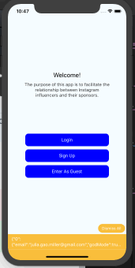

# Instagram Sponsors

by [@codebreakerjulia](https://www.instagram.com/codebreakerjulia/)

## Installation Instructions

* NOTE: This app isn't going to work because I didn't include the Firebase files.
* But if you DO have the firebase files...After downloading the files, run ```npm install``` and then ```npm start``` and then ```react-native-run-ios```

## Session 5
*🗓 F, Nov 16, 2018* <br>
*📍 Home, HaddonView Apartments* <br>
*🕐 5am - ?* <br>
*Commits: ?* <br>

✅ Create the CustomTabBar<br>
✅ Create and connect MyProfileScreen and ExploreScreen<br>
✅ Customize MyProfile screen to display info, allow edits in edit mode. Add block for sponsors but no need to display just yet.<br>
✅ Customize ExploreScreen to display all users.<br>
FIRST THING'S FIRST, create the bottom bar!<br>

## Session 4
*🗓 Th, Nov 15, 2018* <br />
*📍 Home, HaddonView Apartments* <br />
*🕐 6:15pm - 10:45pm* <br />
*Commits: 7,8* <br>

Internal thoughts: disappointed in myself for starting to code so late.<br>

*Current time: 7:56. Gonna take a 15 minute power nap. Just commited. When I wake up am going to describe what I've accomplished so far*<br>
*WOW. Time: 10pm. I just wasted 2 hours doing god knows whut. Ok, not going to try to describe what I've accomplished so far today, just going to continue listening to music and coding.*<br>
*Time: 10:45. Tired😴.. Going to sleep. Going to wake up tomorrow at 4am and continue to work.*

To Do List:<br>
✅ create sponsor accounts on firebase<br>
✅ create userProfile in firebase and create 2 data packet - codebreaker & dvlpr<br>
✅ data packet will include for now godMode(boolean), sponsoring(array of uids), sponsoredBy(array of uids) email, uid, name, instagram, notes, paid(boolean)<br>
✅ successfully fetching userProfiles from firebase database (commit 7)<br>
✅ create dvlpr userProfile data packet from code<br>
✅ when navigating to HomeScreen, will pull user data<br>
◻️ create default bottom tab (similar to instagram) - explore (aka all users) button, my profile screen, which will have sponsors<br>
◻️ set the state the user profile, display user data<br>
◻️ remove the back button from default head and replace with hamburger lines<br>
◻️ create ExploreScreen and MyProfileScreen<br>



## Session 3
*🗓 W, Nov 14, 2018* <br />
*📍 Planet Fitness, Collingswood, NJ* <br />
*🕐 10pm - 2am (4 hours)* <br />
*Commits: 5,6* <br><br>
OMG am so tired. Not going to go in detail but we can now login with email.<br><br>
Next steps:<br>
✅ temporarily disable needing to put in a password for login<br>
✅ temporarily put all sponsor emails on login page for easy access<br>
◻️ create sponsor accounts on firebase<br>
◻️ create userProfile in firebase and create 2 data packet - codebreaker & dvlpr<br>
◻️ data packet will include for now godMode(boolean), sponsoring(array of uids), sponsoredBy(array of uids) email, uid, name, instagram, notes, paid(boolean)<br>
◻️ when navigating to HomeScreen, will check for data with uid, if does not exist, create it with defaults (console warn)<br>
◻️ remove the back button from default head and replace with hamburger lines<br>
◻️ create default bottom tab (similar to instagram) - explore (aka all users) button, my profile screen, which will have my sponsors<br>
◻️ create ExploreScreen and MyProfileScreen<br>

## Session 2

*🗓 W, Nov 12, 2018* <br />
*📍 Haddon Township Library* <br />
*🕐 4:20 pm - 6:20 pm (2 hours)* <br />
*Commits: 4*
<br>
Made almost zero progress today. Tried to connect app to Firebase using react-native-firebase and the [manual integration](https://rnfirebase.io/docs/v5.x.x/installation/initial-setup) for [iOS](https://rnfirebase.io/docs/v5.x.x/installation/ios) but when I tried to follow the instructions and then run the project, the app would crash immediately on the simulator with no error message.
<br><br>
Finally, decided to delete all the changes I made and revert to previous commit. Instead of importing ```react-native-firebase``` I just imported ```firebase``` and referred to one of my previous projects to try to authenticate.
<br><br>
Got a little stuck here due to a syntax error, (forgot to add ```{}``` when importing a constant from another js file}) and went down a rabbithole because of the the simulator error message stating that I had an "invalid API key".
However, with commit 4, we have successfully connected Firebase and authenticated anonymously.


## Session 1

*Date: Su, Nov 11, 2018 (morning)*

### 💭 Learning Lessons 💭

* After adding a new library, need to restart app.

### ✅ Errors Resolved ✅

* Cannot find module 'local-cli/cli.js' when trying to run "npm start"


Resolved: "npm install"

*
*
*
*
*

# Everything below is template stuff (IGNORE)


### Prerequisites

What things you need to install the software and how to install them

```
Give examples
```

### Installing

A step by step series of examples that tell you how to get a development env running

Say what the step will be

```
Give the example
```

And repeat

```
until finished
```

End with an example of getting some data out of the system or using it for a little demo

## Running the tests

Explain how to run the automated tests for this system

### Break down into end to end tests

Explain what these tests test and why

```
Give an example
```

### And coding style tests

Explain what these tests test and why

```
Give an example
```

## Deployment

Add additional notes about how to deploy this on a live system

## Built With

* [Dropwizard](http://www.dropwizard.io/1.0.2/docs/) - The web framework used
* [Maven](https://maven.apache.org/) - Dependency Management
* [ROME](https://rometools.github.io/rome/) - Used to generate RSS Feeds

